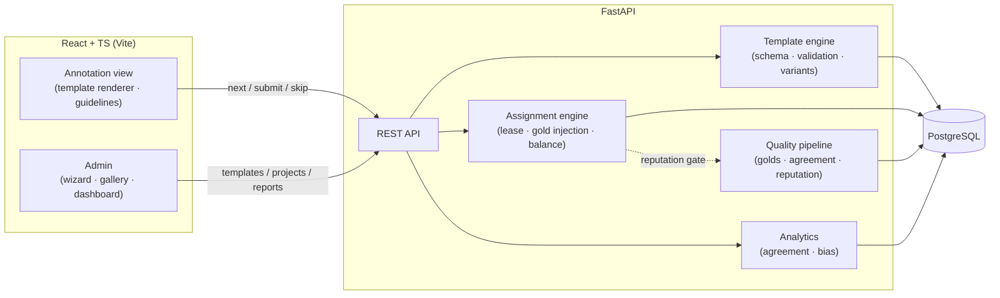

# MiniLP — Mini Labeling Platform

A self-hostable, open-source platform for collecting **any type of human label** through configurable **task templates** — image classification, ratings, policy review, transcription checks, and side-by-side preference judging for RLHF/LLM evaluation — with quality controls built in from the start: gold questions, inter-annotator agreement, rater reputation, and position-bias counterbalancing for comparison tasks.

> **Status:** Milestone 0 (scaffold). See [PLAN.md](PLAN.md) for the full roadmap.

## Why

Label collection tools tend to be either rigid single-purpose UIs or heavyweight enterprise suites — and quality control is usually an afterthought. MiniLP treats both as first-class:

- **Templates, not code** — a template defines what the annotator sees (text, images, audio, side-by-side panels) and what they answer (radio with an "Other" escape hatch, checkboxes, Likert scales, choice buttons, free text). Start from a gallery of examples or from scratch; adding a whole new labeling type means writing a template, not a feature.
- **Guidelines built in** — every project carries markdown annotator instructions, rendered as a collapsible panel in the annotation view.
- **Counterbalanced presentation** — comparison templates pre-generate slots with fixed panel orders (exactly K/2 each); balance is enforced at assignment and preserved through skips, lease expiry, and voided labels.
- **Measurable bias** — every label records both the raw input (side clicked) and the canonical value (item chosen), unlocking left-preference rates, per-annotator bias scores, and per-unit order sensitivity.
- **Rater reputation** — gold questions, peer agreement, bias, and speed flags feed a live score that gates task assignment — uniformly across all template types.

## Architecture



## Quickstart

```bash
docker compose up --build
```

- API: http://localhost:8000 (docs at `/docs`)
- Frontend: http://localhost:5173

### Local development

```bash
# Backend
cd backend
pip install -e ".[dev]"
uvicorn app.main:app --reload
pytest && ruff check .

# Frontend
cd frontend
npm install
npm run dev            # dev server (proxies /api → backend)
npm run test           # vitest: renderer, hotkeys, canonicalization
npm run build          # typecheck + production build

# Hooks
pre-commit install
```

### Annotation UI (M3)

The annotation view is template-driven: it renders any gallery template's layout,
display blocks, and inputs, and drives the `next` / `submit` / `skip` loop. Open it
against a running backend with the project, annotator, and API key in the URL:

```
http://localhost:5173/?project=<id>&annotator=<id>&key=<api-key>
```

Every task is completable from the keyboard alone — number/letter/arrow keys judge,
`Enter` submits (auto-submits when the template has a single required input), `s`
skips, `g` toggles guidelines, `d` toggles dark mode, `u` undoes the last selection,
and `?` opens the shortcut overlay. Key badges are drawn on every option.

## Roadmap

| Milestone | Scope | Status |
|---|---|---|
| M0 | Scaffold, CI, pre-commit, README | ✅ |
| M1 | Template engine, data model, gallery seeds, slot pre-generation | ✅ |
| M2 | Assignment engine (`SKIP LOCKED` leasing, balance under failure) | ✅ |
| M3 | Annotation UI (template renderer, widget registry, hotkey engine, collapsible guidelines) | ✅ |
| M4 | Quality subsystem (golds, reputation, agreement) | ⬜ |
| M5 | Analytics + admin (project wizard, template gallery) | ⬜ |
| M6 | Export, docs, seeded demo | ⬜ |

## Repo layout

```
MiniLP/
├── backend/          # FastAPI app: api/, models/, services/
├── frontend/         # React + TS: Annotate, Admin, Reports views
├── docs/             # DESIGN.md (decision log), architecture notes
├── docker-compose.yml
└── PLAN.md           # full project plan
```

## License

MIT (to be added).
