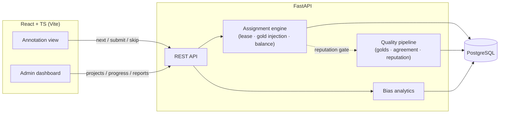

# MiniLP — Mini Labeling Platform

A self-hostable, open-source platform for collecting **pairwise (side-by-side) preference judgments** for RLHF and LLM evaluation — with quality controls built in from the start: position-bias counterbalancing, gold questions, inter-annotator agreement, and rater reputation.

> **Status:** Milestone 0 (scaffold). See [PLAN.md](PLAN.md) for the full roadmap.

## Why

Pairwise preference data is the fuel for RLHF and LLM evals, but naive side-by-side collection is quietly biased: annotators favor one side of the screen, randomization per render doesn't guarantee balance, and low-effort raters poison datasets. MiniLP treats these as first-class scheduling and scoring problems:

- **Counterbalanced presentation** — judgment slots are pre-generated with fixed left/right orders (exactly K/2 each), and balance is enforced at assignment time and preserved through skips, lease expiry, and voided judgments.
- **Blinded UI** — the database knows which response is A/B and which model produced each; annotators only ever see Left/Right.
- **Measurable bias** — every judgment records both the raw side clicked and the canonical choice, unlocking left-preference rates, per-annotator bias scores, and per-pair order sensitivity.
- **Rater reputation** — gold questions, peer agreement, bias, and speed flags feed a live score that gates task assignment.

## Architecture



## Quickstart

```bash
docker compose up --build
```

- API: http://localhost:8000 (docs at `/docs`)
- Frontend: http://localhost:5173

### Local development

```bash
# Backend
cd backend
pip install -e ".[dev]"
uvicorn app.main:app --reload
pytest && ruff check .

# Frontend
cd frontend
npm install
npm run dev

# Hooks
pre-commit install
```

## Roadmap

| Milestone | Scope | Status |
|---|---|---|
| M0 | Scaffold, CI, pre-commit, README | ✅ |
| M1 | Data model, core API, slot pre-generation | ⬜ |
| M2 | Assignment engine (`SKIP LOCKED` leasing, balance under failure) | ⬜ |
| M3 | Annotation UI | ⬜ |
| M4 | Quality subsystem (golds, reputation, agreement) | ⬜ |
| M5 | Bias analytics + admin dashboard | ⬜ |
| M6 | Export, docs, seeded demo | ⬜ |

## Repo layout

```
MiniLP/
├── backend/          # FastAPI app: api/, models/, services/
├── frontend/         # React + TS: Annotate, Admin, Reports views
├── docs/             # DESIGN.md (decision log), architecture notes
├── docker-compose.yml
└── PLAN.md           # full project plan
```

## License

MIT (to be added).
